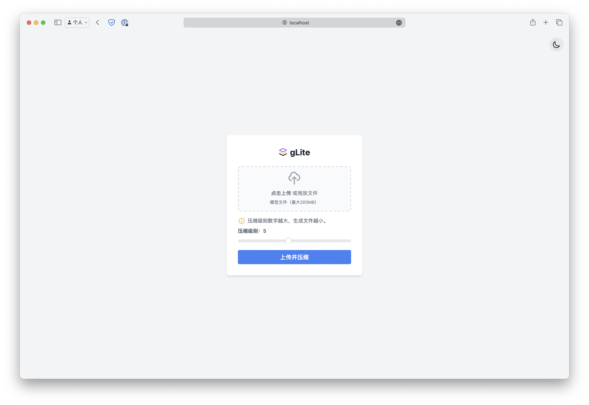
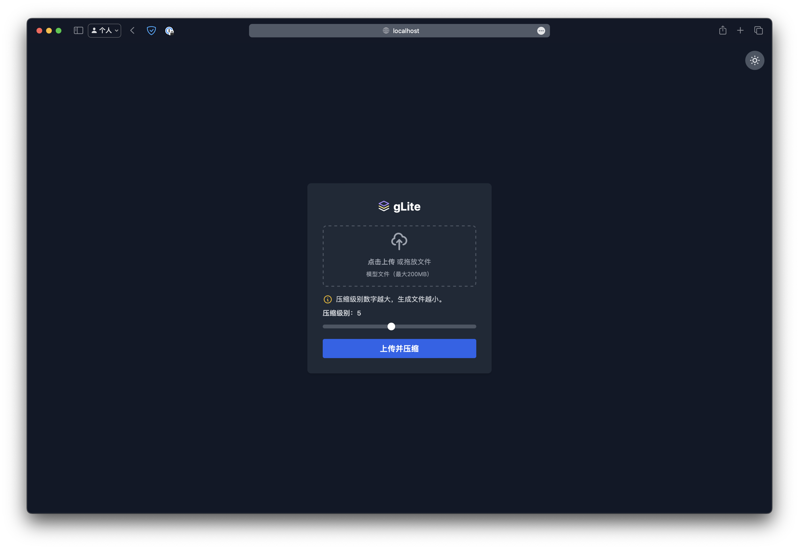

# 背景

在项目前期设计的过程中，我经常会遇到需要将 3D 渲染文件发给客户查看的场景，但是常常因为文件体积过大，上传速度慢，影响了用户体验。为此，我需要一个工具来压缩这些模型文件，减小文件体积，提高传输速度，提升用户体验和工作效率。

# 功能特点

1. 支持上传 glTF 文件并压缩导出。

# ToDo

- [ ] 支持上传 obj、fbx 等模型文件，并进行压缩导出。

- [x] 应用容器化。


# 使用方法

## 裸机上运行

1. 安装依赖

```bash
npm install
```

2. 启动服务

```bash
node server.js
```

访问 http://localhost:3000 即可使用应用。

## 使用 Docker 运行

如果你只想用完即丢，直接使用以下命令构建镜像并运行容器：

1. 构建 Docker 镜像：
   ```
   docker build -t glite .
   ```

2. 运行 Docker 容器：
   ```
   docker run --name=glite -p 3000:3000 -d glite
   ```

3. 访问 http://localhost:3000 即可使用应用。

注意：如果需要持久化存储上传和压缩的文件，请使用以下命令运行容器：

```
docker run -p 3000:3000 -v /path/on/host/uploads:/usr/src/app/uploads -v /path/on/host/compressed:/usr/src/app/compressed -d glite
```

如果你不想自己构建，也可以直接使用我构建好的镜像：

```
docker run --name=glite \
-p 3000:3000 \
-v /path/on/host/uploads:/usr/src/app/uploads \
-v /path/on/host/compressed:/usr/src/app/compressed \
-d echoer/glite
```

请将 `/path/on/host/` 替换为您主机上的实际路径。

## 使用 Docker Compose 运行

1. 确保您的系统上安装了 Docker 和 Docker Compose。

2. 在项目根目录下运行：
   ```
   docker-compose up -d
   ```

3. 访问 http://localhost:3000 即可使用应用。

4. 要停止应用，运行：
   ```
   docker-compose down
   ```

注意：上传的文件和压缩后的文件将被保存在当前目录的 `uploads` 和 `compressed` 文件夹中。

# 运行时截图

<div style="display: flex; justify-content: space-between;">
  
  
</div>
