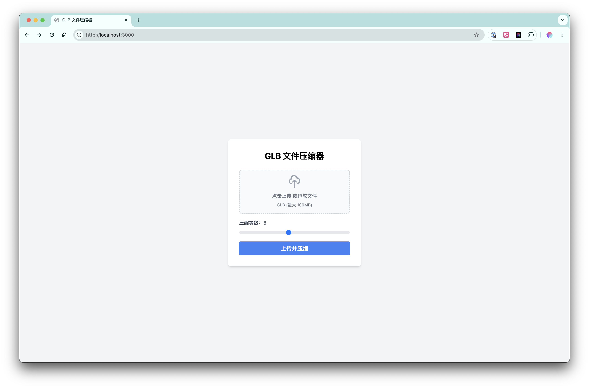

# 产生背景

在项目前期设计的过程中，我经常会遇到需要将 3D 渲染文件发给客户查看的场景，但是常常因为文件体积过大，上传速度慢，影响了用户体验。为此，我需要一个工具来压缩这些模型文件，减小文件体积，提高传输速度，提升用户体验和工作效率。

# 功能特点

1. 支持上传 glTF 文件并压缩导出。
2. 支持上传 png、jpg、jpeg 等图片文件，并进行压缩导出。
3. 支持上传 mp4、mov 等视频文件，并进行压缩导出。
4. 支持上传 obj、fbx 等模型文件，并进行压缩导出。

# 使用方法

1. 安装依赖

```bash
npm install
```

2. 启动服务

```bash
npm run dev
```

3. 访问 http://localhost:3000 即可使用。

# 运行时截图

